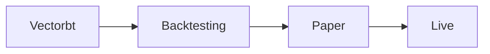

# Strategy

This strategy was just a dumb strategy that I made to show how I use mulitple feeds. It ended up showing good results but I think thats more just the sample that I backtested on. I think it would be a bad strategy to use live. But who knows maybe it does work.

# Basic Workflow

## Vectorbt

Vectorbt is a backtesting library for fast prototyping of trading strategies. It is built on top of Pandas and Numpy with numba optimizations to speed things up.

I use this to get a quick idea if a strategy will work at all. It is also a good way to test out new ideas. I think its the best available backtesting library.

## Backtesting

For every strategy I create an event driven backtester that can be switched live by just changing the mode in the config to live. 

My biggest loss I've had came from a difference between my backtesting bot and my live bot. I thought everything was the same but it wasn't. An if statement was changed and it caused me to take a big loss. Since then I always make sure that its just one bot with a switch to live.

## Paper

I use paper trading to usually just check to make sure everything is working live and check to see if the trades match up between the backtester and the live bot. I also use it to test out new ideas and see how they work live.

## Live

Once  I'm ready to go live I just switch the mode in the config to live and it will start trading live.

